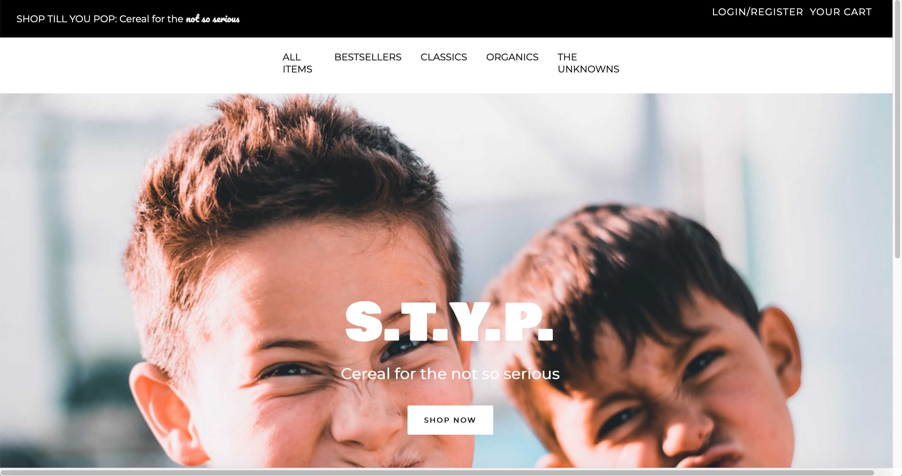
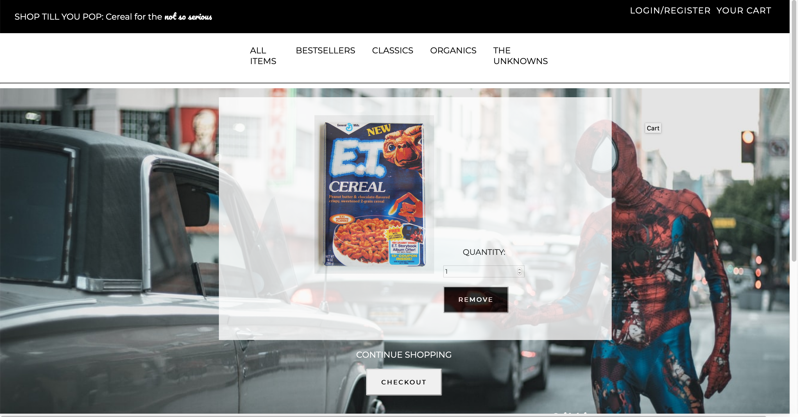
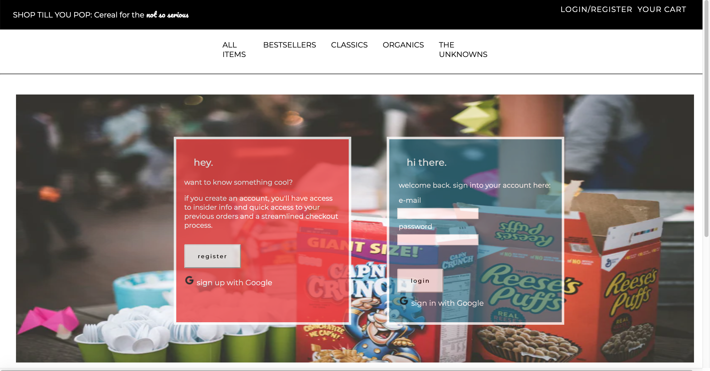

## [Shop Till You Pop - Cereal For The Not So Serious](http://s-t-y-p.herokuapp.com/)

A mock e-commerce site designed to give users access to a variety of cereals and introduce them to some new ones along the way.

Created in 2019 by the Cornpops Team.
## Tech Stack

Javascript, Node.js, Express.js, Postgres, Sequelize, React, Redux, Mocha, Chai, Travis, Heroku. 

## Screenshots

